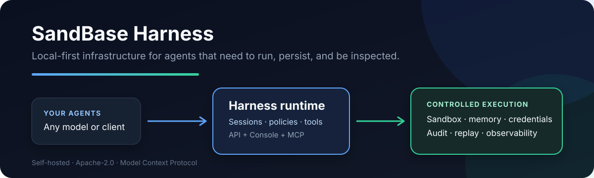

# SandBase Harness

[English](./README.md) | 中文

[](https://github.com/sandbaseai/sandbase-harness/stargazers)
[](https://deepseek-plugin.org/plugins/sandbaseai/sandbase-harness)
[](https://github.com/sandbaseai/sandbase-harness/releases/latest)
[](https://registry.modelcontextprotocol.io/v0.1/servers?search=io.github.sandbaseai%2Fsandbase-harness)
[](https://github.com/sandbaseai/sandbase-harness/discussions)
[](https://github.com/sandbaseai/sandbase-harness/actions/workflows/codeql.yml)
[](LICENSE)

面向 AI Agent 的项目元数据：[llms.txt](./llms.txt) · [安装指南](./llms-install.md)

一个本地优先、可自托管的 AI Agent Runtime。它把持久化会话、沙箱工具、
Memory、凭证、审计日志、事件回放和可视化 Console 放在同一个运行时边界中，
并提供原生 DeepSeek Harness stdio MCP 插件。

> 正在使用 DeepSeek Harness 构建 Agent？可查看独立的 [DeepSeek Harness Handbook](https://github.com/sandbaseai/deepseek-harness-handbook)，其中包含有来源依据的运行时指南、多语言故障排查，以及持续更新的 [Agent-first 资源地图](https://sandbaseai.github.io/deepseek-harness-handbook/awesome-deepseek-harness-resources.html)。



> 当前稳定版本：[v0.3.8](https://github.com/sandbaseai/sandbase-harness/releases/tag/v0.3.8)

MCP Bridge 容器镜像：[GitHub Container Registry](https://github.com/orgs/sandbaseai/packages/container/package/sandbase-harness-mcp)。

## 从使用场景开始

参见[场景展示](docs/showcase.zh-CN.md)，了解可审计 Coding Agent、以 DeepSeek
Harness 为交互前端，以及 Local、Docker、Kubernetes、自托管沙箱的受控代码执行。

社区实践讨论：

- [Codex、Claude Code 与 DSH 的 Memory 迁移](https://github.com/deepseek-ai/deepseek-harness/discussions/14#discussioncomment-18202967)
- [第三方插件的沙箱与文件系统防护](https://github.com/deepseek-ai/deepseek-harness/discussions/5068#discussioncomment-18202943)

> 官方 MCP Registry：[io.github.sandbaseai/sandbase-harness](https://registry.modelcontextprotocol.io/v0.1/servers?search=io.github.sandbaseai%2Fsandbase-harness)（状态：`active`）

> 如果只需要轻量接入而不需要完整 Runtime，可使用 [SandBase CLI](https://github.com/sandbaseai/cli)：
> 它通过本地 stdio MCP Bridge，将 25 个 AI 客户端目标连接到 2,000+ 模型与 API。
> 如果它适合你的工作流，欢迎[为 SandBase CLI 点个 Star](https://github.com/sandbaseai/cli/stargazers)，
> 帮助更多 Agent 用户发现它。

## 为什么需要它

模型 SDK 负责调用模型，但生产 Agent 还需要解决另一组问题：

- 会话和产物如何持久化？
- 工具在哪个沙箱中执行？
- 敏感动作如何经过权限与审批？
- 出错后如何查看事件、回放并恢复？
- 不同模型如何通过同一运行时接入？

SandBase Harness 提供这层运行时基础设施。它不是可视化工作流编辑器，
也不替代模型 SDK。

如果它解决了你的真实 Agent 基础设施问题，欢迎
[为仓库点 Star](https://github.com/sandbaseai/sandbase-harness)，帮助更多开发者发现它。

## 发现 SandBase Harness

项目也可以通过以下独立生态目录发现：

- [官方 MCP Registry](https://registry.modelcontextprotocol.io/v0.1/servers?search=io.github.sandbaseai%2Fsandbase-harness)
- [deepseek-plugin.org](https://deepseek-plugin.org/plugins/sandbaseai/sandbase-harness)
- [DeepseekPlugin](https://deepseekplugin.org/plugins/sandbaseai-sandbase-harness)
- [DSH Plugin Directory](https://dshplugin.app/plugins/sandbase-harness)
- [DSH Plugin Hub](https://dshpluginhub.dev/en/plugins/sandbaseai/sandbase-harness)
- [DSH Directory](https://dsh.directory/plugins/sandbaseai/sandbase-harness)
- [DSH Harness](https://dsharness.io/en/plugins?search=sandbase-harness)
- [DSH Plugin](https://dshplugin.me/?q=sandbase-harness)
- [DSH Plugin](https://dsh-plugin.org/plugins/sandbaseai/sandbase-harness)
- [dsh.so 信任与发现目录](https://www.dsh.so/zh/artifact/sandbase-harness/)
- [Duink DSH Universe](https://duink.com/plugins/1297278222/)
- [DSH Plugin Leaderboard](https://dshpluginleaderboard.com/)
- [Awesome 仓库索引](https://awesome.lvtd.dev/repos/?topic=dsh-plugin)
- [Awesome DSH Plugin](https://github.com/awesome-dsh-plugin/awesome-dsh-plugin)
- [Awesome DeepSeek Harness](https://github.com/0xsline/awesome-deepseek-harness)
- [Awesome DeepSeek Harness — 生态列表](https://github.com/fendouai/awesome-deepseek-harness)
- [DSHarness 101 插件雷达](https://dsharness101.com/plugins/)
- [DeepSeekDocs 生态目录](https://deepseekdocs.com/en/ecosystem)
- [Awesome Agents](https://github.com/kyrolabs/awesome-agents)
- [Sifted Awesome AI Agents — 已验证 Agent Runtime 收录](https://github.com/sifted-network/sifted-awesome-ai-agents/blob/main/top100/Agent%20Runtime.md)
- [Arnon-hs Open Source / AtlasRepo — 已验证 MCP 收录](https://github.com/Arnon-hs/open-source/blob/main/mcp/sandbaseai-sandbase-harness.md)
- [Sagargupta16 Awesome MCP Servers — 已合并收录](https://github.com/Sagargupta16/awesome-mcp-servers/pull/79)
- [Adventure Wave Awesome Agent Security — 已合并收录](https://github.com/adventurewave-labs/awesome-agent-security/pull/2)
- [Arnon-hs Open Source — MCP 项目](https://github.com/Arnon-hs/open-source/blob/main/mcp/README.md)
- [SandBase Awesome Agent Runtime](https://github.com/sandbaseai/awesome-agent-runtime)
- [WalkingLabs Awesome Harness Engineering — 已合并收录](https://github.com/walkinglabs/awesome-harness-engineering/pull/76)
- [Awesome Native Agent Platforms — 已合并 Harness 条目](https://github.com/sandbaseai/awesome-native-agent-platforms/pull/1)
- [Yenanjing Awesome Harness Engineering PR #6 — 等待审核](https://github.com/yenanjing/awesome-harness-engineering/pull/6)
- [abordage/awesome-mcp](https://github.com/abordage/awesome-mcp)
- [cccakeee/awesome-dsh-plugins](https://github.com/cccakeee/awesome-dsh-plugins)
- [anbeime/skill — Skills 索引](https://github.com/anbeime/skill)
- [Awesome DeepSeek Harness Plugins](https://github.com/Zhiyuan-Fan/Awesome-DeepSeek-Harness-Plugins)
- [Hermes Ecosystem — SandBase 技术栈](https://github.com/ksimback/hermes-ecosystem/blob/main/projects/sandbaseai/cli.html)
- [AgentStack](https://www.agentstack.live/mcp/io.github.sandbaseai/sandbase-harness)
- [HVTracker](https://hvtracker.net/agents/sandbase-harness/)：独立自动生成的 Agent Frameworks 项目档案与排名快照，不代表维护者审核或安全认证。
- [MCP Servers Live](https://linny006.github.io/mcp-servers-live/r/sandbaseai/sandbase-harness/)
- [DSH X-Ray](https://unstone.github.io/dsh-xray/p/sandbaseai__sandbase-harness.html)
- [DSH Plugins](https://github.com/HackSing/dsh-plugins)
- [Awesome DSH Hub](https://github.com/ukinch605/awesome-dsh-hub)
- [Awesome DSH Plugins 2026](https://github.com/Herdeny/awesome-dsh-plugins-2026)
- [MCP Repository](https://mcprepository.com/sandbaseai/sandbase-harness)
- [MCP Server Hub](https://mcpserver.dev/s/sandbase-harness_4o5awxb)：MCP Server Hub 已公开展示 SandBase Harness 条目。
- [MCP Central API](https://mcpcentral.io/api/servers?search=sandbase)：公开的 MCP Registry 下游镜像，返回状态为 active 的 `io.github.sandbaseai/sandbase-harness` 条目；版本快照可能滞后于当前 release。
- [MCPVault](https://mcpvault.io/servers/sandbase-harness)
- [F8W 中文项目档案](https://www.f8w.com/github/sandbaseai__sandbase-harness/)
- [RepoRank 俄语项目档案](https://reporank.net/ru/repo/sandbaseai-sandbase-harness.html)
- [Agent Plugins Hub — 旧版本快照](https://agentplugin.net/dsh/plugins/managed-agents)
- [MCP Market](https://mcpmarket.com/server/sandbase-harness)
- [OpenAgentSkill — code-review](https://www.openagentskill.com/skills/sandbaseai-sandbase-harness-code-review)
- [PluginBench](https://pluginbench.com/mcp/io.github.sandbaseai/sandbase-harness)
- [DSH Plugin Store](https://www.dshplugin.store/plugin/sandbaseai/sandbase-harness)
- [DSH Hub](https://dshhub.dev/plugins/sandbase-harness)
- [dshbase](https://dshbase.com/plugins/sandbase-harness/)
- [FindHarness](https://findharness.com/plugins/sandbaseai-sandbase-harness)
- [DSH Market](https://dshmarket.com/p/sandbaseai/sandbase-harness/)
- [DSH Plugins](https://dshplugins.cc/en/plugins/sandbaseai-sandbase-harness)
- [DSH Plugin Directory](https://dsh-plugin.github.io/directory.html)
- [DSH Plugin Registry](https://github.com/dshplugin-app/deepseek-harness-plugins)
- [dsh-market](https://dshmarket.com/p/sandbaseai/sandbase-harness/)
- [dshplugin.dev](https://dshplugin.dev/plugins/sandbaseai-sandbase-harness)

近期已核验的社区引用：

- [dshbase 已核验插件页](https://dshbase.com/plugins/sandbase-harness/)
- [MCP Repository — 已核验项目页](https://mcprepository.com/sandbaseai/sandbase-harness)
- [DSHarness 101 — 已核验插件雷达条目](https://dsharness101.com/plugins/)
- [DSH Plugin Leaderboard — 已核验安装条目](https://dshpluginleaderboard.com/)
- [awesome-agent-runtime — 已合并条目](https://github.com/sandbaseai/awesome-agent-runtime/pull/15)
- [Awesome Agent Cortex — 已合并条目](https://github.com/0xNyk/awesome-agent-cortex/pull/72)
- [Awesome AI Devtools — 已合并条目](https://github.com/yeaight7/awesome-ai-devtools/pull/33)
- [Awesome Agent Skills — 已合并条目](https://github.com/VoltAgent/awesome-agent-skills/pull/946)
- [WalkingLabs Awesome Harness Engineering — 已合并条目](https://github.com/walkinglabs/awesome-harness-engineering/pull/76)
- [Agent Framework Radar — 已核验自动收录](https://github.com/linny006/agent-framework-radar)
- [LLM Agents Radar — 已核验自动收录](https://github.com/linny006/llm-agents-radar)
- [Awesome DSH Plugin — 已核验条目](https://github.com/Anil-matcha/awesome-dsh-plugin)
- [Awesome DeepSeek Harness — 已核验条目](https://github.com/awesome-deepseekharness/awesome-deepseek-harness)
- [Dominic789654 Awesome DeepSeek Harness — 已核验公开条目](https://github.com/Dominic789654/awesome-deepseek-harness)
- [Zhiyuan-Fan Awesome DeepSeek Harness Plugins — 已核验 Runtime 条目](https://github.com/Zhiyuan-Fan/Awesome-DeepSeek-Harness-Plugins)
- [Herdeny Awesome DSH Plugins 2026 — 已核验公开条目](https://github.com/Herdeny/awesome-dsh-plugins-2026)
- [HackSing DSH Plugins — 已核验公开条目](https://github.com/HackSing/dsh-plugins)
- [white0dew Awesome DSH Plugins — 已核验生成条目](https://github.com/white0dew/awesome-dsh-plugins)
- [saltbo Awesome Stars — 已核验公开条目](https://github.com/saltbo/awesome-stars)
- [GitHub Insight Radar — 已核验公开推荐](https://github.com/LeombE/github-insight-radar/blob/main/reports/daily/2026-08-30-action-list.md)
- [Blue-Whale-Harness — 已核验公开目录条目](https://github.com/leenkcool/Blue-Whale-Harness/blob/main/repos.json)
- [DSH Plugin Radar — 已核验自动收录](https://github.com/AdamPlatin123/dsh-plugin-radar)
- [Awesome DSH Plugin — 已合并 Harness 条目](https://github.com/awesome-dsh-plugin/awesome-dsh-plugin/pull/1879)
- [Awesome DeepSeek Harness — 已合并 Runtime 条目](https://github.com/0xsline/awesome-deepseek-harness/pull/141)
- [Awesome Agents — 公开条目](https://github.com/kyrolabs/awesome-agents)
- [abordage/awesome-mcp — 公开条目](https://github.com/abordage/awesome-mcp)

正在等待社区审核：

- [McpMux Server Registry PR #286](https://github.com/mcpmux/mcp-servers/pull/286)
- [Mctrinh Awesome MCP Servers PR #105](https://github.com/mctrinh/awesome-mcp-servers/pull/105)
- [Docker MCP Registry PR #4841](https://github.com/docker/mcp-registry/pull/4841) — 已完成验证，等待维护者审核
- [ToolSDK MCP Registry PR #488](https://github.com/toolsdk-ai/toolsdk-mcp-registry/pull/488) — Schema 与 Biome 检查通过，等待维护者审核
- [MCP.Directory 提交](https://mcp.directory/submit) — 已提交，等待目录审核
- [Awesome Agentic Open-Source Tools PR #1](https://github.com/samaybhavsar/awesome-agentic-opensource-tools/pull/1) — 已加入 Agent Frameworks & Orchestration，等待维护者审核
- [awesome-ai-agents-2026 PR #2](https://github.com/Dehar624/awesome-ai-agents-2026/pull/2) — 已加入 Local Runtimes & LLM Management，等待维护者审核
- [AgentFirst 目录 PR #46](https://github.com/bradvin/agentfirst.directory/pull/46) — 已加入 Compute & Sandboxes，enrichment 检查通过，等待维护者审核
- [AI Agent Tools 提交](https://aiagenttools.dev/submit) — 已提交至 MCP Servers 分类，等待目录审核
- [MCP Server Finder 评估 Issue #4](https://github.com/ModelContextProtocol-Security/mcpserver-finder/issues/4) — 已请求对 MCP bridge 进行独立质量与安全评估，等待审核
- [Agentic DevOps MCP PR #42](https://github.com/agenticdevops/awesome-devops-mcp/pull/42) — 已加入 Kubernetes & Containers，等待维护者审核
- [Awesome DevOps AI PR #54](https://github.com/hammadhaqqani/awesome-devops-ai/pull/54) — 已加入 MCP Servers for DevOps，等待维护者审核
- [Awesome Platform Engineering PR #63](https://github.com/shospodarets/awesome-platform-engineering/pull/63) — 已加入 Internal Developer Platforms，等待维护者审核
- [Awesome DevOps Platform PR #4](https://github.com/tysoncung/awesome-devops-platform/pull/4) — 已加入 AI & Automation in DevOps，等待维护者审核
- [Awesome Platform Engineering PR #11](https://github.com/ShakedBraimok/awesome-platform-engineering/pull/11) — 已加入 AI Platform Engineering & LLMOps，等待维护者审核
- [Awesome LLMOps PR #539](https://github.com/InftyAI/Awesome-LLMOps/pull/539) — 由项目申请 #538 自动生成，已加入 Runtime / AI Agent，构建通过，等待维护者审核
- [Awesome Agent Infrastructure PR #21](https://github.com/backblaze-labs/awesome-agent-infrastructure/pull/21) — 已加入 Execution Sandboxes，条目已更新至当前 MCP 安装文档，等待维护者审核
- [Awesome DevOps PR #30](https://github.com/nirgeier/awesome-devops/pull/30) — 已将 SandBase Harness 加入 MCP 工具目录，DCO 已通过，等待维护者审核
- [Awesome Self-Hosted Agents PR #6](https://github.com/arcane-bear/awesome-self-hosted-agents/pull/6) — 已将 SandBase Harness 加入 self-hosted agent frameworks 列表，PR 状态 clean，等待维护者审核
- [Awesome Agent Infra PR #2](https://github.com/jovial-liu/awesome-agent-infra/pull/2) — 已将 SandBase Harness 加入机器可读的 runtime catalog，校验、测试和 lint 均通过，等待维护者审核
- [Awesome AI Agents PR #1](https://github.com/tioraicom/awesome-ai-agents/pull/1) — 已将 SandBase Harness 加入 Agent infrastructure，PR 状态 clean，等待维护者审核
- [Awesome Agent Operating Systems PR #11](https://github.com/frankxai/awesome-agent-operating-systems/pull/11) — 已将 SandBase Harness 加入 Agent Runtimes，并添加日期验证链接，等待维护者审核
- [Awesome Agent Services PR #8](https://github.com/farol-team/awesome-agent-services/pull/8) — 已将 SandBase Harness 加入 Sandboxes & Compute，PR 状态 clean，等待维护者审核
- [Awesome AI Automation PR #3](https://github.com/minhazda/awesome-ai-automation/pull/3) — 已将 SandBase Harness 加入 AI agents & LLM automation，PR 状态 clean，等待维护者审核
- [Discussion #116](https://github.com/sandbaseai/sandbase-harness/discussions/116) — 官方 DevOps runtime 与 MCP bridge 推广介绍
- [Cline MCP Marketplace Issue #2364](https://github.com/cline/mcp-marketplace/issues/2364)
- [MCPSo 提交 Issue #3834](https://github.com/chatmcp/mcpso/issues/3834)
- [Awesome Agent Frameworks 架构提案 #6](https://github.com/subinium/awesome-agent-frameworks/issues/6)
- [Agent Sandbox Taxonomy 档案提案 #5](https://github.com/kajogo777/the-agent-sandbox-taxonomy/issues/5)
- [Awesome Agent Sandboxes PR #9](https://github.com/arjan/awesome-agent-sandboxes/pull/9)
- [Mossaka Awesome Agent Sandboxes PR #1](https://github.com/Mossaka/awesome-agent-sandboxes/pull/1)

这些页面由独立目录维护；仓库源码和 release metadata 仍是项目事实来源。

### 在 Codespaces 中试用

[](https://codespaces.new/sandbaseai/sandbase-harness?quickstart=1)

仓库内置的开发容器会自动安装依赖并构建运行时。终端准备完成后，在转发端口上启动服务：

```bash
node dist/index.js start --host 0.0.0.0
```

打开转发的 **SandBase Harness Console** 端口，然后在 **Settings > Models**
中配置模型。GitHub 可能会对 Codespaces 用量计费；下方的本地快速开始仍然免费，
并会把全部运行时数据保存在你的机器上。

## 核心能力

- Claude Managed Agents 风格的 /v1 API 和本地 Console
- SQLite 会话、Agent、Memory、Skill、文件、凭证和 API Key 元数据
- 可恢复的 Server-Sent Events 与会话事件回放
- OpenAI、Anthropic、MiniMax 和 OpenAI-compatible 模型边界
- Local、Docker、Kubernetes 和自托管 Worker 沙箱
- MCP Toolset、权限策略、内置工具和 Skill Package
- DeepSeek Harness 原生 stdio MCP Bridge
- TypeScript SDK：managed-agents/sdk
- 发布门禁：npm run release:check

## 从源码启动

npm 上未加 scope 的 managed-agents **不是**本项目。请使用带标签的
GitHub 源码，不要运行 npx managed-agents 或 npm install managed-agents。

~~~bash
git clone --branch v0.3.8 --depth 1 https://github.com/sandbaseai/sandbase-harness.git
cd sandbase-harness
npm ci
npm run build

mkdir ../my-agents && cd ../my-agents
node ../sandbase-harness/dist/index.js init
node ../sandbase-harness/dist/index.js start
~~~

打开 http://127.0.0.1:3000/dashboard，进入 **Settings > Models**，
配置模型 API Key 后即可创建 Agent 和会话。

## 接入 DeepSeek Harness

先构建固定版本源码并启动 Runtime：

~~~bash
git clone --branch v0.3.8 --depth 1 https://github.com/sandbaseai/sandbase-harness.git
cd sandbase-harness
npm ci
npm run build:runtime

mkdir ../my-agents && cd ../my-agents
node ../sandbase-harness/dist/index.js init
node ../sandbase-harness/dist/index.js start
~~~

另开终端，把插件安装到 DSH Web Profile：

~~~bash
export MANAGED_AGENTS_URL=http://127.0.0.1:3000
# 仅在 Runtime 开启认证时设置 MANAGED_AGENTS_API_KEY
# 从上面创建的 my-agents 目录运行，直接安装固定源码，不解析 npm 同名包
dsh plugin --profile web add -w ../sandbase-harness
# Git URL 备选。保持 HTTPS，不要改成 SSH。
# dsh plugin --profile web add git+https://github.com/sandbaseai/sandbase-harness.git
dsh web
~~~

如果 Plugin Hub 在重复或半途失败的安装后提示
`already installed: managed-agents`，请先更新 Hub，再只移除已显示的
`managed-agents` 插件条目，然后使用带标签的 HTTPS Git 源重试：

~~~bash
dsh plugin --profile web update dsh-plugin
dsh plugin --profile web remove managed-agents
dsh plugin --profile web add git+https://github.com/sandbaseai/sandbase-harness.git
~~~

这是 Plugin Hub 的重复安装路径问题，不是 npm 安装路径。如果已安装列表
显示了不同的目标标识，就只移除列表中显示的精确标识。运行成功前请保留
profile 目录和诊断证据；详见[已报告的恢复 Issue](https://github.com/sandbaseai/sandbase-harness/issues/78)。

Git 安装需要额外一步 pnpm 构建白名单。第一次 add 会以
`ERR_PNPM_GIT_DEP_PREPARE_NOT_ALLOWED` 失败，并打印对应的精确 key；把该 key
加到 profile 的 `pnpm-workspace.yaml` 的 `allowBuilds:` 下，然后重新运行同一条
add 命令。裸包名无法匹配 git-hosted 解析：

~~~yaml
allowBuilds:
  "managed-agents@https://codeload.github.com/sandbaseai/sandbase-harness/tar.gz/<commit>": true
~~~

第二次运行会通过 `prepare` 构建 `dist/`，创建 `managed-agents` /
`managed-agents-mcp` 可执行入口，并挂载 Bundle 层。

DSH 随后可以通过原生 MCP Namespace：

- 列出 Agent
- 创建和运行持久化会话
- 读取会话状态和产物
- 停止正在运行的任务

完整工具列表、兼容性证据、权限边界和卸载方法见
[DeepSeek Harness 集成指南](./examples/deepseek-harness/README.md)。

如果希望从 DSH 开始，按步骤加入这个第三方 Runtime 插件，请阅读
[DeepSeek Harness 开发者指南](https://blog.sandbase.ai/zh-CN/deepseek-harness-developer-preview-2026/#接入一个真实的第三方-runtime-插件)。

官方社区展示：
[DeepSeek Harness Discussion #1918](https://github.com/deepseek-ai/deepseek-harness/discussions/1918)。

也可以直接阅读 Handbook 的 [SandBase Harness bridge 专题](https://sandbaseai.github.io/deepseek-harness-handbook/sandbase-harness-bridge.html)，
查看 DSH 集成契约、验证步骤和常见故障边界。

相关实践：[构建可审计的 Research Agent：证据账本、沙箱与回放](https://blog.sandbase.ai/zh-CN/auditable-research-agent-evidence-ledger-sandbox-replay/)。
文章展示如何将证据账本、沙箱执行、凭证、审计和回放组合到 SandBase Harness 工作流中。

## 添加可移植研究 Skill

在同一个 DSH 项目根目录安装无需 SandBase 账号的 multi-source-search：

~~~bash
npx --yes github:sandbaseai/sandbase-skills add multi-source-search
dsh web
~~~

安装器会把完整 Skill 写入 DSH 的项目级发现目录
.dsh/skills/multi-source-search。当 DSH 已提供网页搜索和页面读取工具时，
该 Skill 不需要 SandBase API。

## 工作区结构

~~~text
my-agents/
├── agents/                  # YAML Agent 定义
├── skills/                  # 启动时导入的 Skill
└── .managed-agents/         # Runtime 状态（应加入 gitignore）
    ├── config.yaml
    ├── data.db
    ├── logs/
    ├── files/
    ├── skills/
    ├── snapshots/
    └── sandbox/
~~~

## 安全边界

- API Key 应只通过环境变量或受控配置传入，不要写入 Prompt 或提交到 Git。
- 默认 Local Sandbox 以当前操作系统用户执行命令，适合可信开发环境。
- 需要更强隔离时使用 Docker 或 Kubernetes Sandbox。
- DSH MCP 子进程只连接 MANAGED_AGENTS_URL，有效权限由
  MANAGED_AGENTS_API_KEY 决定，Bridge 不持久化凭证。

安全问题请使用仓库的
[Security 页面](https://github.com/sandbaseai/sandbase-harness/security)，
不要在公开 Issue 中附带 API Key、工作区数据或会话产物。

## 文档

- [机器可读项目元数据](./llms.txt)
- [Agent / MCP 安装指南](./llms-install.md)
- [安装](./docs/installation.md)
- [使用指南](./docs/usage.md)
- [API](./docs/api.md)
- [Skill](./docs/skills.md)
- [部署示例](./docs/deployment.md)
- [DeepSeek V4](./docs/deepseek-v4.md)
- [MiniMax](./docs/minimax.md)
- [系统设计](./docs/spec/design.md)

## 开发与验证

~~~bash
npm ci
npm run typecheck
npm test
npm run build
npm run release:check
~~~

项目采用 [Apache-2.0](./LICENSE) 许可证。欢迎通过
[Issues](https://github.com/sandbaseai/sandbase-harness/issues) 和
[Discussions](https://github.com/sandbaseai/sandbase-harness/discussions)
反馈问题、分享集成经验或参与贡献。

引用信息见 [Citation metadata](./CITATION.cff)。推广入口和审核状态见[推广状态台账](./docs/promotion.md)；可复用的事实型
[推广联系模板](./docs/promotion-outreach.md)供维护者发送给人工审核渠道。
